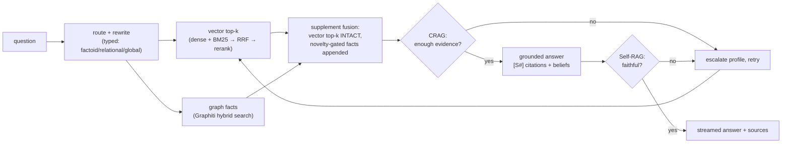
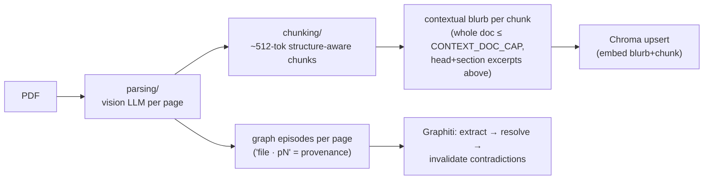
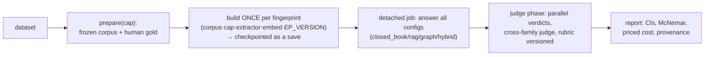

# Noema — Architecture One-Pager

The 10-minute map. Depth lives in the [docs book](docs/01-overview.md); decisions and the
measurements behind them live in [studies/](studies/README.md). This page is what you need
in your head before touching anything.

## The system in one sentence

Documents go in once and are indexed **several ways at the same time** (a contextual
vector base, a temporal knowledge graph, LightRAG); a chat pipeline answers questions
grounded in whichever memory — or combination — you select, with citations back to
document + page; a benchmark measures the memory methods against each other on the same
corpus, honestly.

## Layers

| layer | code | one-line contract |
|---|---|---|
| HTTP surface | `backend/app/routers/` | thin; no business logic; NDJSON streams for anything long |
| Expert loop | `backend/app/pipeline.py` | route → retrieve → grade (CRAG) → answer + cite → verify (Self-RAG); one file, whole story |
| Memory engines | `app/retrieval/` `app/graph/` `app/lightrag/` (`app/textgraph/` dormant) | ingest + query per strategy; each owns its store; selected per message |
| Ingestion | `app/parsing/` `app/chunking/` | PDF → per-page Markdown → provenance-tagged chunks |
| Bench | `app/bench/` | prepare → gold → build-once (fingerprinted) → detached run → statistical report |
| Provider seam | `app/llm_client.py` + `app/config.py` | the ONLY LLM/embedding gateway; OpenAI ↔ llmaas is a `.env` swap (graph gets its clients via `app/graph/providers.py`, the judge via `JUDGE_*` — same rule, dedicated seams) |
| User data | `auth_store` `conversation_store` `memory_store` `beliefs` | file-backed by design (locked-down prod machine: no DB, no Docker, no admin) |
| Checkpoints | `app/saves.py` | named snapshots per engine (graph+vector together; LightRAG workspace whole) |

## The three flows

### Query (chat, Expert mode)

The fusion rule is **measured, not aesthetic**: the vector top-k reaches the context
identical to rag-alone, and graph facts only *append* through a novelty gate. Two stronger
graph roles were tried and lost on the bench (see `studies/` + `tests/test_fusion.py`,
which locks the contract). Don't re-litigate without a bench run.

### Ingest (Graph page upload)

Same document, several lenses, shared provenance — a citation always resolves to
document + page regardless of which memory produced it.

### Bench (the measurement)

Everything expensive is resumable at its own granularity (episode / document / answer /
verdict), runs survive the browser tab (detached jobs + reattach), and anything that
changes what a build or verdict *means* is stamped into fingerprints or provenance so
results can never silently mix.

## The runtime model — read this before "scaling" anything

**One uvicorn worker, one FalkorDB process, by design.** These are load-bearing
assumptions, not oversights:

- `graph/manager.py` holds one FalkorDriver per domain **bound to the app's event loop**
  (two drivers = the "event loop is closed" class of bugs).
- `retrieval/index_cache.py` (BM25 + records) and `bench/jobs.py` (detached runs) are
  in-process registries.
- Writes per domain are serialized with per-domain locks.

Horizontal scaling would break all three silently. The intended deployment is a
single-box internal tool; if that ever changes, these three modules are the complete
list of what must move to shared state. Corollary: `uvicorn --reload` restarts on any
file edit and kills in-flight detached runs (they resume at zero re-cost — but don't
edit code mid-run).

## Deployment constraint (why the stack looks like this)

Production is a **locked-down corporate Windows machine: no Docker, no admin, restricted
installs, possibly no outbound internet**. Hence: file-backed auth/conversations (stdlib,
no DB), pinned `requirements.txt` carried as offline wheels, datasets carried as files,
FalkorDB as an external server there (`GRAPH_BACKEND=falkor_server` — the bundled binary
is Unix-only), and the committed knowledge stores (the repo travels as a self-contained
"suitcase"). See [RUN_ON_WINDOWS.md](RUN_ON_WINDOWS.md).

## Where everything lives

Code: the repository map in [README.md](README.md#repository-map). State (databases,
stores, saves, bench artifacts): [STORAGE.md](STORAGE.md) — read it before deleting
*anything*, some state currently lives under `tests/results/`. Operations:
[RUNBOOK.md](RUNBOOK.md). Vocabulary: [GLOSSARY.md](GLOSSARY.md). Hard-won lessons:
[docs/12-gotchas.md](docs/12-gotchas.md).
